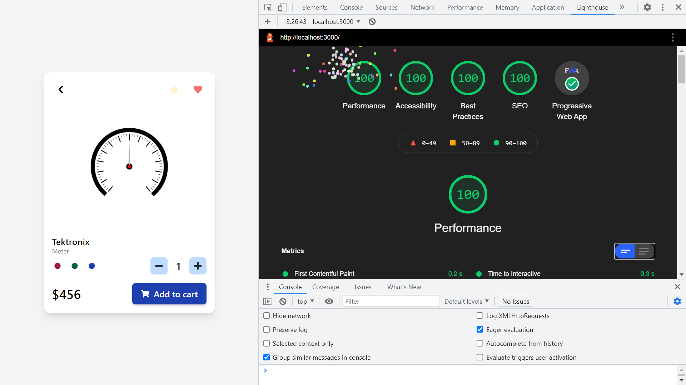

# :zap: Next Tailwind Card

* A PWA Next/Tailwind template app with card component and perfect Lighthouse score
* **Note:** to open web links in a new window use: _ctrl+click on link_


## :page_facing_up: Table of contents

* [:zap: Next Tailwind Card](#zap-next-tailwind-card)
  * [:page_facing_up: Table of contents](#page_facing_up-table-of-contents)
  * [:books: General Info](#books-general-info)
  * [:camera: Screenshots](#camera-screenshots)
  * [:signal_strength: Technologies](#signal_strength-technologies)
  * [:floppy_disk: Setup](#floppy_disk-setup)
  * [:computer: Code Examples](#computer-code-examples)
  * [:clipboard: Status & To-Do List](#clipboard-status--to-do-list)
  * [:clap: Inspiration](#clap-inspiration)
  * [:file_folder: License](#file_folder-license)
  * [:envelope: Contact](#envelope-contact)

## :books: General Info

* Next.js used for frontend is for server-rendered react apps. It has automatic code splitting, simple page-based routing, built-in CSS support and hot reloading. Every component file in the pages folder is treated as a page
* Tailwind CSS added to Next.js as part of [Next.js example app](https://tailwindcss.com/docs/guides/nextjs)
* [`Just-in-Time Mode`](https://tailwindcss.com/docs/just-in-time-mode) used for Tailwind CSS.
* Progressive Web App (PWA) enabled. Latest Next v11 used includes server code and makes adding PWA much easier
* [Custom Document](https://nextjs.org/docs/advanced-features/custom-document) `pages/_document` used to add to app's <html> and <body> tags

## :camera: Screenshots



## :signal_strength: Technologies

* [React v17](https://reactjs.org/) Javascript library.
* [React icons v4](https://www.npmjs.com/package/react-icons)
* [Next v11](https://nextjs.org/) minimalist framework for rendering react apps on the server.
* [Tailwind v2](https://tailwindcss.com/) utility-first CSS framework
* [PostCSS v8](https://postcss.org/) tool for transforming CSS with JavaScript
* [pngTree](https://pngtree.com/) downloadable images, png etc.
* [pwa-asset-generator v4](https://www.npmjs.com/package/pwa-asset-generator) Automated PWA asset generation and image declaration. Creates icons and JSON array for PWA manifest.json file

## :floppy_disk: Setup

* `npm run dev` runs the app in the development mode. Open [http://localhost:3000](http://localhost:3000) to view it in the browser.
* `npm run build` builds the app for production to the `build` folder. It correctly bundles React in production mode and optimizes the build for the best performance. The build is minified and the filenames include the hashes.
* `npm run start` to run the built app.

## :computer: Code Examples

* `pages/_document` HTML render used to add custom HTML to existing Next document page

```javascript
render() {
	return (
		<Html lang="en">
			<Head>
				<meta
					name="description"
					content="Build a Next.js PWA with 100% lighthouse score"
				></meta>
				<meta
					name="viewport"
					content="width=device-width, initial-scale=1.0"
				/>
				<meta name="theme-color" content="#0D47A1" />
				<link rel="manifest" href="/manifest.json" />
				<link
					href="/favicon-16x16.png"
					rel="icon"
					type="image/png"
					sizes="16x16"
				/>
				<link
					href="/favicon-32x32.png"
					rel="icon"
					type="image/png"
					sizes="32x32"
				/>
				<link rel="apple-touch-icon" href="/apple-icon.png"></link>
			</Head>
			<body>
				<Main />
				<NextScript />
			</body>
		</Html>
	);
}
```

## :clipboard: Status & To-Do List

* Status: Working. [Deployed to Netlify](https://festive-lamarr-61ac43.netlify.app/)
* To-Do: Keep updated and use as boilerplate app

## :clap: Inspiration

* [Install Tailwind CSS with Next.js](https://tailwindcss.com/docs/guides/nextjs)
* [Next.js example app](https://tailwindcss.com/docs/guides/nextjs)
* [Not Science Lab: Product Card Tutorial (Next.js, Tailwind CSS and react-icons)](https://www.youtube.com/watch?v=E11eRGweC3M)
* [Convert your website into a PWA in 8 simple steps](https://milindsoorya.site/blog/convert-your-website-into-a-pwa-in-8-simple-steps-next-js-pwa-series-part-2#step-6-edit-your-_documentjs-file)
* [How to Deploy Next.js Sites to Netlify](https://www.netlify.com/blog/2020/11/30/how-to-deploy-next.js-sites-to-netlify/)

## :file_folder: License

* N/A

## :envelope: Contact

* Repo created by [ABateman](https://github.com/AndrewJBateman), email: gomezbateman@yahoo.com